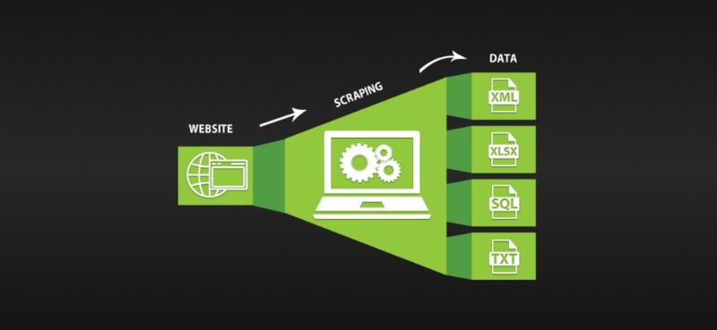

# Web-scrapper-for-Trustpilot-website

Web scrapper tool for trustpilot website

The python .py file is used to extract reviews and related information form the Trustpilot website whith respect to the brand choosen and number of pages selected. Then the data is stored as .csv format.

It is useful tool to create dataset on own and can be used for furthur tasks in data analysis NLP such as Data cleaning, Data preparation, NLP (Sentiment analysis).

For the working example of such tasks you can refer to my repository [Nike online store review analysis](https://github.com/Pramod07Ch/Data_Science_Projects/tree/master/Nike_onlinestorereview_analysis)
